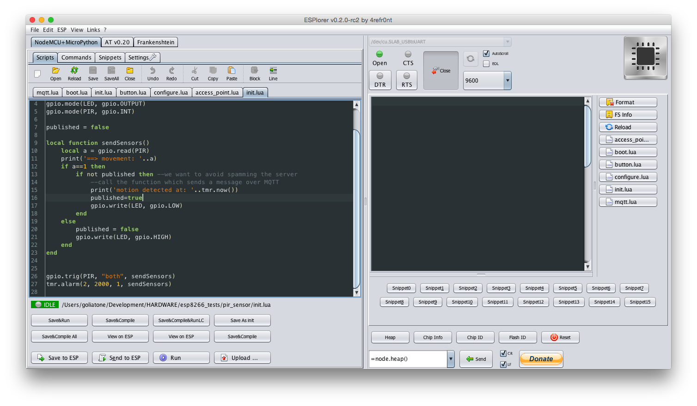

## WeeThings

An introduction to the [ESP8266][esp8266-wiki] microcontroller, a $4 WiFi module with an ARM processor, running the NodeMCU firmware, programmed in the [Lua][lua] programming language.

This little thing is great because:
 - it's cheap: $4, compared to $24 for the more popular arduino
 - it comes with WiFi: if you were to get an arduino, you'd _also_ have to get a WiFi module, possibly even an ESP8266!

With it, we can stream data from sensors, control appliances, build armies of robots...all over WiFi...all for $4.


<br/>
(_[Logo][logo-dribbble] by Tracy Loi_)

### TOC

- [Prerequisites](#prerequisites)
- [Materials](#materials)
- [Quick Set Up](#quick-set-up)
- [Set up](#set-up)
    - [ESPlorer](#esplorer)
    - [SiLabs Drivers](#silabs-drivers)
    - [espytool](#espytool)
    - [NodeMCU firmware](#nodemcu-firmware)
    - [Flashing the NodeMCU](#flashing-the-nodemcu)
- [Colophon](#colophon)
- [Resources](#resources)
    - [ESP8266](#esp8266)
    - [Lua](#lua)

---
### Prerequisites

This tutorial expects:
- some basic programming knowledge
- you know how to open a **terminal**, execute scripts and type in a commands
- you can find your way around **Github**
- a working **Java** installation
    - [Java SE version 7][java-se] or above
    - we won't be using Java directly, but the application that loads software onto the microcontroller is a Java application

We've tested this tutorial on **MacOS**. It's possible to do with Windows, but there might be subtle differences when it comes to flashing the board and using the tools.

### Materials
The list of materials is intentionally short; we can get up and running pretty fast.

Hardware:
* [NodeMCU dev board][amazon-esp]
* [Micro USB cable][amazon-usb]

Software:
* [esptool][esptool] Used to flash NodeMCU devkit
* [SiLabs Drivers][silabs-drivers] Used to communicate with the devkit
* [ESPlorer][esplorer] IDE used to program the devkit

Binaries:
* [NodeMCU firmware][esp-binaries] Latest release of the NodeMCU firmware

---
### Quick Set Up
Here is a `bash` script to bootstrap via CLI. This scripts automates a bunch of steps that you would have to do manually otherwise. Those steps are explained in the next section so you understand what the script is doing. If you are doing the quick set up, you do **NOT** have to clone this repo. The script will do it all for you.

Type the following in a terminal window:
```
$ curl -SLs https://raw.githubusercontent.com/goliatone/wee-things-workshop/master/bin/bootstrap | bash
```

1. Connect the board to your computer.

2. Install the SiLabs Driver: The image is located in the `drivers` folder. Double click to start the installation process. THIS WILL REQUIRE YOU TO RESTART YOUR COMPUTER

2. Open up the ESPlorer IDE: `cd` into  **bin/ESPlorer**. run `java -jar "ESPlorer.jar"`

3. Install esptool to flash the board: `cd` into **bin/esptool**. run `python setup.py install`

4. Prep the board to be flashed: Press the board's **FLASH** button and press the **RST** button at the same time. You should see an LED blink on the board.

5. Flash the board:  `cd` into **bin/esptool**. run `esptool.py --port=/dev/cu.SLAB_USBtoUART write_flash -fm=dio -fs=32m -ff=40m 0x00000 ../nodemcu_integer_0.9.6-dev_20150627.bin`

6. **Unplug the USB cable** and **plug it** again.

7. Woohoo!! Now we are ready to start coding. Open up the ESPlorer IDE (step 2) if you've closed it.

---
### Set up

#### ESPlorer
You can download the ESPlorer IDE from [here][esplorer]. However, we will be using the version bundled with this tutorial for convenience.

_NOTE:_ ESPlorer requires [Java SE version 7][java-se] or greater to be installed in your computer.

First, we need to un-zip the **ESPlorer.zip** file.

On Mac to open the IDE you need to do so from **terminal**. Open a new **terminal** window, `cd` to the **ESPlorer** directory created after uncompressing the zip file, and type this command in your terminal:

```
java -jar ESPlorer.jar
```

*NOTE:*
Some online resources tell you to `sudo` the command in order to run the **ESPlorer** IDE. Most _likely_ you will be able to leave it out.

This command wil open up the IDE, it should look something similar to this:



We will be using the ESPlorer to validate our next step, installing the SiLabs Drivers.

Maybe the command did not work. It could be due to different things. If you get an error message that looks similar to this one it means that you have an outdated version of java:

>Exception in thread "main" java.lang.UnsupportedClassVersionError: ESPlorer/ESPlorer : Unsupported major.minor version 51.0
at java.lang.ClassLoader.defineClass1(Native Method)
at java.lang.ClassLoader.defineClassCond(ClassLoader.java:637)
at java.lang.ClassLoader.defineClass(ClassLoader.java:621)
at java.security.SecureClassLoader.defineClass(SecureClassLoader.java:141)
at java.net.URLClassLoader.defineClass(URLClassLoader.java:283)
at java.net.URLClassLoader.access$000(URLClassLoader.java:58)
at java.net.URLClassLoader$1.run(URLClassLoader.java:197)
at java.security.AccessController.doPrivileged(Native Method)
at java.net.URLClassLoader.findClass(URLClassLoader.java:190)
at java.lang.ClassLoader.loadClass(ClassLoader.java:306)
at sun.misc.Launcher$AppClassLoader.loadClass(Launcher.java:301)
at java.lang.ClassLoader.loadClass(ClassLoader.java:247)

You should [update][java-se] your Java version.

#### SiLabs Drivers

From the SiLabs driver [download page][silabs-drivers]:

>The CP210x USB to UART Bridge Virtual COM Port (VCP) drivers are required for device operation as a Virtual COM Port to facilitate host communication with CP210x products.

In order for your computer to communicate with the devkit you need to have installed special drivers. You can find the download [link here][silabs-drivers]. The bash script already downloaded the image file into your bin folder so open it up and follow the install instructions.

The ESP8266 runs a Lua interpreter and you can send in commands and read out results over serial.

_NOTE:_

This requires your computer to restart, save your work.


#### esptool

We will first install **esptool** in order to flash our boards. It's a `python` script which can be run using the Mac's default `python`. Open terminal and cd to the **esptool** directory and run the following command:

```
python setup.py install
```

This will install `esptool.py` system-wide.

If you do not want a global install you can follow the [instructions][esptool-install] on the repo to use the tool locally. It's really easy.

#### NodeMCU firmware
You can find the latest NodeMCU firmware at their github repository, in the release page following this [link][esp-binaries].

The ESP8266 chip comes loaded with an AT command set, and it's meant to be used by an external controller like an Arduino driving the chip over serial.

#### Flashing the NodeMCU
In this step, we are going to flash our devkit with the NodeMCU binaries downloaded before so we can start loading programs to the board. It sounds intimidating, but it's quite simple actually.

We already downloaded the NodeMCU [firmware][firmware], installed the SiLabs drivers, and have **esptool** installed.

Connect the board to the computer using the USB cable.

From the project's main directory, open terminal and `cd` to the **bin** directory where the **nodemcu_float_0.9.6-dev_20150704.bin** file is located.

We need to put the board in flash mode. To do so hold down the board's **FLASH** button and press the **RST** button at the same time. You should see an LED blink on the board.

From terminal, `cd` into your project's **bin/esptool** directory. Then
type the following command in terminal and press enter:

```
esptool.py --port=/dev/cu.SLAB_USBtoUART write_flash -fm=dio -fs=32m -ff=40m 0x00000 ../nodemcu_integer_0.9.6-dev_20150627.bin
```
The script should provide some feedback in the terminal window while is executing.

```
Connecting...
Erasing flash...
Wrote 400384 bytes at 0x00000000 in 38.5 seconds (83.1 kbit/s)...

Leaving...
```

Now **unplug the USB cable** and **plug it** again.

Congratulations, we now have a board properly flashed and we are ready to start uploading code. We will do so using an IDE.

Now you can proceed with the next tutorials:
* [Hello World][hello-world]
* [Hello Blink][hello-blink]
* [Hello WiFi][hello-wifi]
* [WiFi Blink][hello-blink]
<!--
### More on ESP8266

The [ESP8266][espressif] is a microcontroller with 2.4 GHz WiFi capabilities supporting the WPA/WPA2 [protocols][wpa-protocols], general-purpose input/output (GPIO), Inter-Integrated Circuit (I2C), analog-to-digital conversion (ADC), Serial Peripheral Interface (SPI), and pulse-width modulation (PWM). The chip operates at 80Mhz, has a 64KB boot ROM, 64KB instruction RAM, and 96KB data RAM.
-->

---
### Colophon
And with this we conclude the boring setup process. We are ready to start coding and making things. We will start by doing the mandatory [hello world][hello-world] tutorial which will teach us how to load code into a devkit board. Next, we will do the classical [hello world of electronics][hello-blink] and get an LED blinking.

If you are not familiar with the Lua programming language you can always follow a quick intro tutorial. Check out the Lua links in the [Resources](#resources) section.

You should also check out NodeMCU's [API wiki page][nodemcu-wiki-api]. It covers succinctly all the different modules and their methods.

---
### Resources

#### ESP8266
* [ESP8266 forum][esp8266-forum]

#### NodeMCU
* [NodeMCU wiki][nodemcu-wiki]
* [The unoficial NodeMCU FAQ][nodemcu-faq]
* [MQTT on the NodeMCU][nodemcu-mqtt]
* [NodeMCU iot 1][nodemcu-iot-1]
* [NodeMCU iot 2][nodemcu-iot-1]

#### Lua
* [Cheatsheet][lua-cheatsheet]
* [Official site][lua]
* [Quick introduction][lua-intro]
* [Introductory tutorial][lua-tutorial]
* [Tutorials directory][lua-tutorials-directory]

If you are new to programming, there is an online tutorial following the *Learn the Hard Way* method that uses Lua. [Here][learn-lua]

Lua has a package manager, [LuaRocks][luarocks]. A package manager is a set of tools that help you install, upgrade, configure, and manage software packages, or modules, and their dependencies. From the LuaRocks website:
>LuaRocks allows you to create and install Lua modules as self-contained packages called rocks.


If you are using Atom you can install the following plugins:
* [Lua support][language-lua]
* [Lua linter][lua-linter]

Sublime:
* [SublimeLinter-lua][SublimeLinter-lua]


http://luajit.org/install.html

```
brew install luajit --with-52compat
```

<!-- LINKS -->
[espressif]: http://espressif.com/en/products/esp8266/

[firmware]: https://github.com/nodemcu/nodemcu-firmware/releases
[nodemcu-wiki]: https://github.com/nodemcu/nodemcu-firmware/wiki
[nodemcu-wiki-api]: https://github.com/nodemcu/nodemcu-firmware/wiki/nodemcu_api_en

[amazon-usb]: http://www.amazon.com/AmazonBasics-Micro-USB-USB-Cable-Meters/dp/B00NH124VM/
[amazon-esp]: http://www.amazon.com/Eleduino-Version-Internet-ESP8266-Development/dp/B010O1G1ES/

[esplorer]: http://esp8266.ru/esplorer/#download
[esptool]: https://github.com/themadinventor/esptool
[esptool-install]: https://github.com/themadinventor/esptool#installation--dependencies


[esp-binaries]: https://github.com/nodemcu/nodemcu-firmware/releases
[esp8266-forum]: http://www.esp8266.com
[esp8266-wiki]: https://en.wikipedia.org/wiki/ESP8266


[nodemcu-faq]: http://www.esp8266.com/wiki/doku.php?id=nodemcu-unofficial-faq
[silabs-drivers]: https://www.silabs.com/products/mcu/Pages/USBtoUARTBridgeVCPDrivers.aspx
[nodemcu-mqtt]: http://www.allaboutcircuits.com/projects/introduction-to-the-mqtt-protocol-on-nodemcu/


[lua]: http://www.lua.org
[lua-intro]: http://luatut.com
[lua-tutorial]: http://lua-users.org/wiki/LuaTutorial
[lua-tutorials-directory]: http://lua-users.org/wiki/TutorialDirectory
[lua-ide]: http://studio.zerobrane.com/download
[lua-cheatsheet]: http://thomaslauer.com/download/luarefv51.pdf
[language-lua]: https://atom.io/packages/language-lua
[lua-linter]: https://github.com/AtomLinter/linter-lua
[SublimeLinter-lua]: https://github.com/SublimeLinter/SublimeLinter-lua
[luarocks]: https://luarocks.org

[java-install]: http://crunchify.com/where-is-java-installed-on-my-mac-osx-system/
[java-se]: http://www.oracle.com/technetwork/java/javase/downloads/jdk8-downloads-2133151.html


[hello-world]: https://github.com/goliatone/wee-things-workshop/tree/master/tutorials/1-hello-world
[hello-blink]: https://github.com/goliatone/wee-things-workshop/tree/master/tutorials/2-hello-blink
[hello-wifi]: https://github.com/goliatone/wee-things-workshop/tree/master/tutorials/3-wifi-ap
[hello-blink]: https://github.com/goliatone/wee-things-workshop/tree/master/tutorials/4-hello-wifi-blink

[bin-directory]: https://github.com/goliatone/esp8266-intro
[wpa-protocols]: https://en.wikipedia.org/wiki/Wi-Fi_Protected_Access
[nodemcu-iot-1]: http://www.allaboutcircuits.com/projects/guts-of-the-iot-part-1-building-nodemcu-from-source-for-the-esp8266/
[nodemcu-iot-2]: http://www.allaboutcircuits.com/projects/how-to-make-an-interactive-tcp-server-nodemcu-on-the-esp8266/
[learn-lua]: http://www.phailed.me/2011/02/learn-lua-the-hard-way-1/

[logo-dribbble]: https://dribbble.com/shots/2352690-Hardware-Workshop
