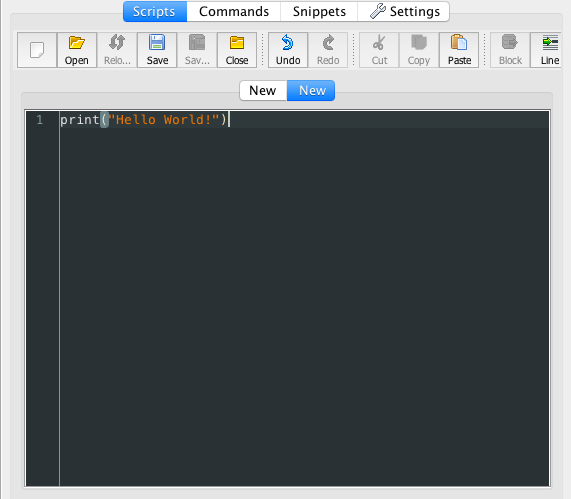
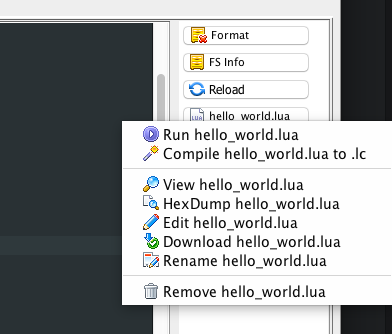

## Hello World!

In this tutorial we will learn how to load a simple **hello world** script into our NodeMCU devkit board using the ESPLorer IDE.

You should follow the [introductory tutorial][intro-tutorial] to get your Mac environment ready.

The actual program we are going to write is rather simple. The main focus is the process to get code running. We will also learn how to upload and execute a file from the ESPLorer IDE.

Here is the code we will be running:

```lua
print("Hello World!")
```

Once we have completed this tutorial we should be able to write our own programs and upload them to a NodeMCU board.

### Firing up the IDE

If you don't have the ESPLorer IDE running then open a terminal window, `cd` to the directory containing the **ESPLorer.jar** file and type the following command:

```
sudo java -jar ESPLorer.jar
```

### Connecting to the board
In order for the IDE to talk to the devkit we need to stablish a connection first.

In the top right corner of the IDE:
- Select **/dev/cu.SLAB_USBtoUART** port
- Select 9600
- Click Open


_NOTE:_ If the connection was successful the Open button should toggle to a Close state. If this is not working make sure that you have installed the [SiLabs drivers][silabs-drivers]. If you don't see the /dev/cu.SLAB_USBtoUART option in the dropdown menu also make sure that you installed the drivers and restarted your computer. More information on the [introductory tutorial][intro-tutorial].

### Create a new file

We will create a new file, name it `hello_world.lua` and upload it to the board using the ESPlorer IDE.

You can use the IDE to create and edit files as well as to manage the files in the board. Also, we use it to upload files.

To create a new file:

- Select NodeMCU tab
- Select Script tab
- Click the blank file icon


- Copy and paste the following code snippet:
    - `print("Hello World!")`
- Click the floppy disk icon and name the file `hello_world.lua`


Type the **hello world** code:

```lua
print("Hello World!")
```



If we have the board connected to the ESPlorer, when we create a new, once we save it locally the file will also be uploaded to the board.


Next we will upload our file to the board!


Once the file has been updloaded, we need to click the refresh button on the right most menu and it will show us all the files in the board:


### Executing a file

From the ESPLorer IDE, there are different ways we can execute a file.

If we right click on the `hello_world.lua` file, we get a context menu with different options:



If we click on *Run hello_world.lua*, you will never believe what happens next...


We get the string `Hello World!` printed in the IDE's console window.

### Features

The ESPlorer IDE has a lot of different and useful features that you will discover as you use the program. Here we cover a small sample of those.

Show the current files uploaded in the board:

Send commands:

Snippets:


[silabs-drivers]: https://www.silabs.com/products/mcu/Pages/USBtoUARTBridgeVCPDrivers.aspx
[intro-tutorial]: https://github.com/goliatone/wee-things-workshop

<!--
http://stackoverflow.com/questions/31304082/how-to-recover-nodemcu-infinite-loop
-->
