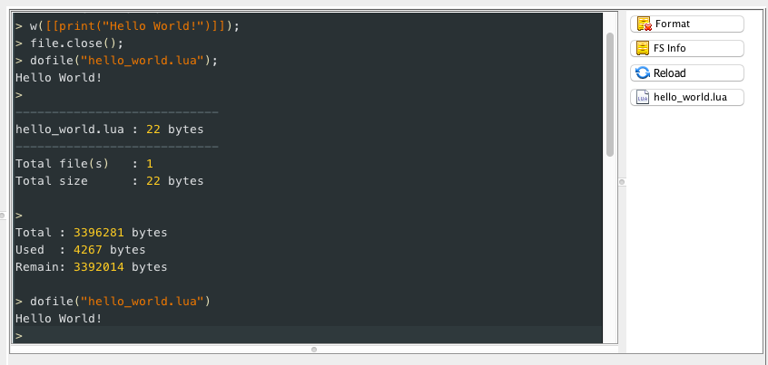

## Hello World!

In this tutorial we will learn how to load a simple **hello world** script into our NodeMCU devkit board using the [esp clit tool][node-esp].

You should follow the [introductory tutorial][intro-tutorial] to get your Mac environment ready.

Once we have completed this tutorial we should be able to write our own programs and upload them to a NodeMCU board.


### Lua Strings

The actual program we are going to write is rather simple. The main focus is the process to get code running. We will also learn how to upload and execute a file using the [esp clit tool][node-esp].

Here is the code we will be running:

```lua
print("Hello World!")
```

The `print` statement takes a string parameter and will output it to the console, in this case the string "Hello World!".

_NOTE_

In Lua you use two dots to concatenate strings,
```lua
print("Hello ".."World!")
```
You could also use variables. If you assign a string value to a variable, you could dynamically create a string:

```
local name = "Peperone"
print("Hello "..name.."!") -- outputs: Hello Peperone!
```

If we want to interpolate variables in a string, it can get unwieldy pretty fast:
```lua
local name = "Peperone"
local something = "pancakes"
print("Hello "..name..", do you like "..something.."?") -- outputs: Hello Peperone, do you like pancakes?
```

In lua you can do [string interpolation][wiki-string-interpolation] using the `string.format` utility, which you can read about [here][wiki-lua-string-interpolation].

> String interpolation is the process of evaluating a string literal containing one or more placeholders, yielding a result in which the placeholders are replaced with their corresponding values.

```lua
local name = "Peperone"
local something = "pancakes"
print(string.format("Hello %s, do you like %s?", name, something)) -- outputs: Hello Peperone, do you like pancakes?
```

#### Multiline
In Lua you can also have multiline strings using the `[[` characters to open a multiline sequence, and the `]]` characters to close it.


```lua
conn:send([[<h2>The module MAC address is: ]].. ap_mac..[[</h2>
    <h2>Enter SSID and Password for your WIFI router</h2>
    <form action='' method='get' accept-charset='ascii'>
    SSID:
    <input type='text' name='SSID' value='' maxlength='32' placeholder='your network name'/>
    <br />
    Password:
    <input type='text' name='PASS' value='' maxlength='100' placeholder='network password'/>
    <br/>
    <input type='submit' value='Submit' />
    </form> </body> </html>]])
```

### Create a new file

We will create a new file, name it `hello_world.lua` and upload it to the board using the [esp clit tool][node-esp].

You can use any text editor or IDE to create and edit files. I recommend using Atom since you can lint your lua code rather easily.


### Executing a file

From the ESPLorer IDE, there are different ways we can execute a file.

If we right click on the `hello_world.lua` file, we get a context menu with different options:


If we click on *Run hello_world.lua*, you will never believe what happens next...



We get the string `Hello World!` printed in the IDE's console window.


### Features

The ESPlorer IDE has a lot of different and useful features that you will discover as you use the program. Here we cover a small sample of those.

We can send commands to the board from the IDE.

Another way we have to execute a file, is to send a Lua command directly to the board. In this case, the [dofile][dofile] command. You can read more about the command [here][dofile-tutorial]. Basically the `dofile` commands opens the named file and executes its contents. This is actually really handy, since the ESP8266 have so little resources it enables us to only bring into memory chunks of code if and when needed.


Show the current files uploaded in the board:

Send commands:

Snippets:


[silabs-drivers]: https://www.silabs.com/products/mcu/Pages/USBtoUARTBridgeVCPDrivers.aspx
[intro-tutorial]: https://github.com/goliatone/wee-things-workshop

[dofile-tutorial]: http://luatut.com/dofile.html
[dofile]: http://www.lua.org/pil/8.html

[wiki-lua-string-interpolation]: http://lua-users.org/wiki/StringInterpolation
[wiki-string-interpolation]: https://en.wikipedia.org/wiki/String_interpolation
<!--
http://stackoverflow.com/questions/31304082/how-to-recover-nodemcu-infinite-loop
-->

[node-esp]: https://www.npmjs.com/package/node-esp
